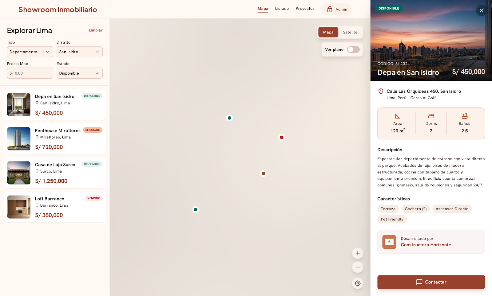
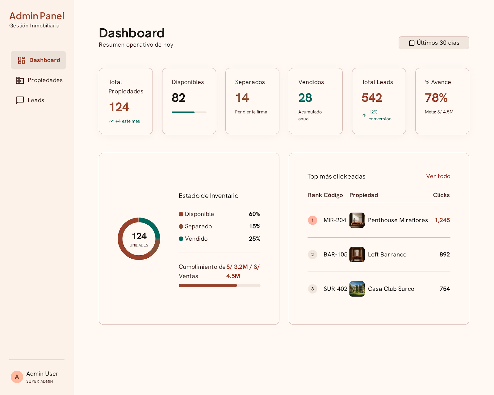

# Showroom Digital Inmobiliario

Showroom inmobiliario interactivo con mapa de propiedades, filtros avanzados y formulario de contacto.

## Stack

- **React 19** + **Vite 8** (static site)
- **TypeScript** (strict mode)
- **Tailwind CSS 4** + **shadcn/ui**
- **React Query** + **Zustand** (state management)
- **Leaflet** (mapas interactivos)
- **Supabase** (base de datos y autenticación)

## Development

```bash
# Instalar dependencias
pnpm install

# Servidor de desarrollo
pnpm dev

# Build de producción
pnpm build

# Preview del build
pnpm preview

# Tests
pnpm test

# Verificar (typecheck + lint + test + build)
pnpm verify
```

## Deploy

El proyecto se despliega automáticamente en **GitHub Pages** cuando se hace push a `main`.

```
https://statick88.github.io/showroom-digital-inmobiliario/
```

### Capturas

| Showroom Mapa | Dashboard Admin |
|--------------|----------------|
|  |  |

### Secrets requeridos

| Secret | Descripción |
|--------|-------------|
| `NEXT_PUBLIC_SUPABASE_URL` | URL del proyecto Supabase |
| `NEXT_PUBLIC_SUPABASE_PUBLISHABLE_KEY` | Clave publicable de Supabase |
| `NEXT_PUBLIC_AGENCIA_ID` | ID de la agencia inmobiliaria |

## Estructura

```
src/
├── domain/           # Entidades y repositorios
├── data/             # Implementaciones de repositorios
├── presentation/     # Componentes y hooks
│   └── components/
│       ├── map/      # Componentes del mapa de propiedades
│       └── ui/       # Componentes shadcn/ui
├── lib/              # Utilidades
└── config/           # Configuraciones
```

## Licencia

MIT