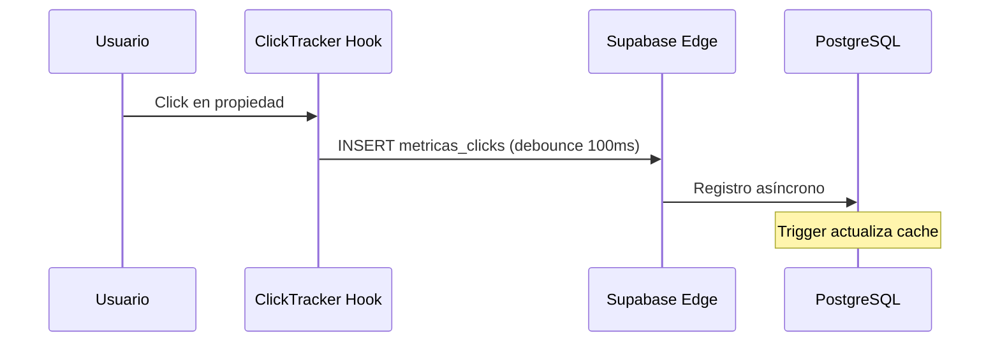

# SDD - Showroom Digital Inmobiliario

## 1. Arquitectura General y Stack Tecnológico

### 1.1 Stack Propuesto

| Capa | Tecnología | Justificación |
|------|------------|---------------|
| **Frontend** | Vite 8 + React 19 + TypeScript | Desarrollo ultra-rápido, HMR instantáneo, bundle optimizado estático |
| **Styling** | Tailwind CSS 4 + shadcn/ui | Consistencia visual, componentes accesibles, tema oscuro/claro integrado |
| **State Management** | Zustand + React Query v5 | Zustand para UI state (filtros, selección), React Query para server state con cache automática |
| **Mapas** | Leaflet + React Leaflet | Render 2D ligero, compatible con SVGs overlay para planos de edificios |
| **Backend** | Supabase (PostgreSQL + Auth + Edge Functions) | BaaS serverless: auth, DB, storage, functions sin infra |
| **Base de Datos** | PostgreSQL (via Supabase) | GIS (PostGIS para coordenadas), JSONB para imágenes, RLS integrado |
| **Deploy** | GitHub Pages (estático) | Costo $0, SSL automático, CI/CD integrado via GitHub Actions |

### 1.2 Arquitectura Hexagonal (Clean Architecture)

```
src/
├── domain/             # Entidades y puertos (sin dependencias externas)
│   └── entities/       # propiedad.ts, lead.ts, metrica.ts
├── data/               # Adaptadores de infraestructura
│   └── repositories/   # propiedades.repository.impl.ts, leads.repository.impl.ts
├── presentation/       # Componentes React (interfaz)
│   ├── components/
│   │   ├── map/        # MapView, PropertyMarkers, MetricasPanel
│   │   └── ui/         # shadcn components
│   └── hooks/          # usePropiedades, useMetricas, useLeads
└── lib/                # Utils y clientes externos
    └── supabase/       # Cliente configurado
```

### 1.3 Flujo de Datos

```
[Usuario] → [MapView/SVG Overlay] → [useMetricas hook] → [Supabase Edge Function] → [PostgreSQL View]
                                    ↓
                              [Click Tracker] → [metricas_clicks table]
```

---

## 2. Modelo de Datos (Esquema BD)

### 2.1 Tablas Principales

#### `propiedades`
| Campo | Tipo | Descripción |
|-------|------|-------------|
| `id` | uuid (PK) | Identificador único |
| `codigo` | text | Código único (ej: "L-001", "D-302") |
| `tipo` | enum | lote | departamento | casa | local | oficina | terreno |
| `estado` | enum | disponible | separado | vendido |
| `precio` | numeric(12,2) | Precio en moneda local (PEN/USD) |
| `moneda` | text | PEN (default) o USD |
| `titulo` | text | Nombre comercial del producto |
| `descripcion` | text | Descripción detallada |
| `area_m2` | numeric | Área en metros cuadrados |
| `cuartos` | int | Número de habitaciones |
| `banios` | int | Número de baños |
| `ubicacion` | point | Coordenadas PostGIS (x,y) para mapa |
| `svg_id` | text | ID del elemento SVG en el plano interactivo |
| `imagenes` | jsonb[] | URLs de renders/imágenes premium |
| `agencia_id` | uuid (FK) | Propietario del listado |
| `publicada` | boolean | Si aparece en el showroom |
| `destacada` | boolean | Si aparece en la sección destacados |

#### `metricas_clicks`
| Campo | Tipo | Descripción |
|-------|------|-------------|
| `id` | bigint (PK) | Identificador autoincremental |
| `propiedad_id` | uuid (FK) | Propiedad referenciada |
| `tipo_evento` | enum | click | favorito | contacto | vista_detalle |
| `sesion_id` | text | ID de sesión anónima (UUID v4) |
| `perfil_id` | uuid (FK) | Usuario autenticado (opcional) |
| `pagina_origen` | text | reverse path tracking |
| `created_at` | timestamptz | Timestamp del evento |

#### `leads`
| Campo | Tipo | Descripción |
|-------|------|-------------|
| `id` | uuid (PK) | Identificador único |
| `propiedad_id` | uuid (FK) | Propiedad del interés |
| `nombre/email/telefono` | text | Datos de contacto |
| `score` | int (0-100) | Lead scoring automático |
| `estado` | enum | nuevo | contactado | calificado | perdido | ganado |
| `notas` | text | Observaciones del agente |

### 2.2 Vistas Analíticas (PostgreSQL)

```sql
-- Vista materializada para top propiedades por clicks (refresh cada hora)
create materialized view mv_top_propiedades_clicks as
select p.id, p.codigo, p.titulo, count(mc.id)::bigint as total_clicks
from propiedades p
left join metricas_clicks mc on mc.propiedad_id = p.id
group by p.id
order by total_clicks desc;

-- Dashboard agregado por agencia
create function obtener_metricas_dashboard(p_agencia_id uuid)
returns table (
  total_propiedades bigint,
  disponibles bigint,
  separadas bigint,
  vendidas bigint,
  total_clicks bigint,
  total_leads bigint,
  avance_porcentaje numeric
);
```

---

## 3. Especificación de Componentes Clave

### 3.1 Módulo Visual (Frontend)

#### Arquitectura de Imágenes Premium

```
/static/masterplan.svg          → Plano base desde render 3D (Socio A)
/static/masterplan-areas/*.svg  → Overlays por área interactiva
/public/images/propiedades/     → Renders premium (optimizados WebP/AVIF)
/public/thumbnails/             → Thumbnails 200px para cards
```

#### Integración SVG Interactivo

```tsx
// MapView.tsx - Componente principal
<MapContainer center={[-12.04, -77.04]} zoom={16}>
  <ImageOverlay url="/masterplan.jpg" bounds={bounds} />
  <SVGOverlay 
    url="/masterplan.svg" 
    eventHandlers={{
      click: (e) => handleSVGClick(e.target.getAttribute('data-property-id'))
    }}
  />
  <MarkerClusterGroup>
    {propiedades.map(p => (
      <PropertyMarker 
        key={p.id} 
        propiedad={p} 
        onClick={() => trackClick(p.id)} 
      />
    ))}
  </MarkerClusterGroup>
</MapContainer>
```

#### Property Marker States

| Estado | Color (Glassmorphism) | Badge |
|--------|----------------------|-------|
| Disponible | `bg-emerald-500/20` | ✓ Disponible |
| Separado | `bg-amber-500/20` | ⧖ Separado |
| Vendido | `bg-red-500/20` | ✗ Vendido |

### 3.2 Módulo de Analítica (Click Tracking)

#### Estrategia de Captura



#### Implementación ClickTracker

```ts
// useClickTracker.ts
export function useClickTracker() {
  const sessionId = useSessionId(); // UUID v4 persistente en localStorage
  
  const trackClick = useCallback(
    debounce(async (propiedadId: string, tipo: TipoEvento = "click") => {
      await supabase.from("metricas_clicks").insert({
        propiedad_id: propiedadId,
        tipo_evento: tipo,
        sesion_id: sessionId,
        pagina_origen: window.location.pathname
      });
    }, 100),
    [sessionId]
  );
  
  return { trackClick };
}
```

#### Optimización de Rendimiento

- **Debounce 100ms** para evitar bombardeo de clicks
- **Batch inserts** cada 5 eventos o 5 segundos (whichever comes first)
- **Lazy loading** de imágenes con Intersection Observer
- **Cache de React Query** con stale-while-revalidate (5 min)

---

## 4. Roadmap del MVP (Fases)

### Fase 1: Foundation (Semana 1)
| Tarea | Estimado | Prioridad |
|-------|----------|-----------|
| Setup Vite + React 19 + Tailwind | 2h | ⭐⭐⭐ |
| Configurar Supabase client + RLS | 3h | ⭐⭐⭐ |
| MapView base con Leaflet | 4h | ⭐⭐⭐ |
| PropertyCard component | 3h | ⭐⭐⭐ |
| ClickTracker hook | 2h | ⭐⭐⭐ |
| **TOTAL** | **14h** | |

### Fase 2: Stock & Dashboard (Semana 2)
| Tarea | Estimado | Prioridad |
|-------|----------|-----------|
| MetricasPanel con 6 cards | 3h | ⭐⭐⭐ |
| Dashboard API function | 2h | ⭐⭐⭐ |
| Filtros por estado/tipo | 3h | ⭐⭐ |
| Lead form + validación Zod | 3h | ⭐⭐ |
| **TOTAL** | **11h** | |

### Fase 3: Optimización & Deploy (Semana 3)
| Tarea | Estimado | Prioridad |
|-------|----------|-----------|
| SVGs interactivos para lotes | 4h | ⭐⭐⭐ |
| Optimización de imágenes (WebP) | 2h | ⭐⭐ |
| Deploy GitHub Pages + Actions | 2h | ⭐⭐⭐ |
| Documentación usuario final | 2h | ⭐ |
| **TOTAL** | **10h** | |

---

## 5. Decisiones Técnicas (ADR)

### 5.1 Vite vs Next.js
**Decisión:** Vite 8 + React 19
- **Razón:** MVP requiere velocidad de build (<1s) y despliegue estático ($0)
- **Tradeoff:** No SSR/SSG, pero con React Query + precache se compensa

### 5.2 Supabase vs Firebase
**Decisión:** Supabase
- **Razón:** RLS más granular, PostGIS para coordenadas, SQL view para analytics
- **Tradeoff:** Menos mercado que Firebase, pero más adecuado para datos estructurados

### 5.3 Click Tracking en Cliente
**Decisión:** Captura directa a Supabase
- **Razón:** Simpleza para MVP, Edge Functions futuro para agregación en tiempo real
- **Tradeoff:** Latencia cliente→servidor, compensada con debounce

---

## 6. Consideraciones de Seguridad (LPDP - Perú)

### 6.1 Cumplimiento
- **Datos personales:** Solo nombre/email/telefono en leads
- **Consentimiento:** Implicito al enviar formulario
- **Eliminación:** Lead borrado en 30 días sin actividad
- **RLS:** Todos los queries filtrados por `agencia_id`

### 6.2 Secrets Management
```
VITE_SUPABASE_URL=anon_key_only
VITE_SUPABASE_PUBLISHABLE_KEY=restricted_permissions
VITE_AGENCIA_ID=uuid_filtro_inicial
```

---

## 7. Endpoints API (RPC Supabase)

| Endpoint | Método | Props | Retorno |
|----------|--------|-------|---------|
| `obtener_propiedades` | RPC | `{agenciaId, filtros}` | Propiedades + metadatos |
| `obtener_metricas_dashboard` | RPC | `{agenciaId}` | `{disponibles, separadas, vendidas, avancePorcentaje}` |
| `obtener_top_clicks` | RPC | `{agenciaId, limite}` | Top propiedades por interés |
| `crear_lead` | INSERT | Lead data | ID del lead |

---

## 8. Métricas de Éxito (KPIs)

| Métrica | Target MVP | Herramienta |
|---------|------------|------------|
| Tiempo carga inicial | < 2s | Vite bundle analyzer |
| CLS (Core Web Vitals) | < 0.1 | Lighthouse |
| Precisión clicks → leads | > 8% | Supabase analytics |
| Uptime GitHub Pages | 99.9% | GitHub status |